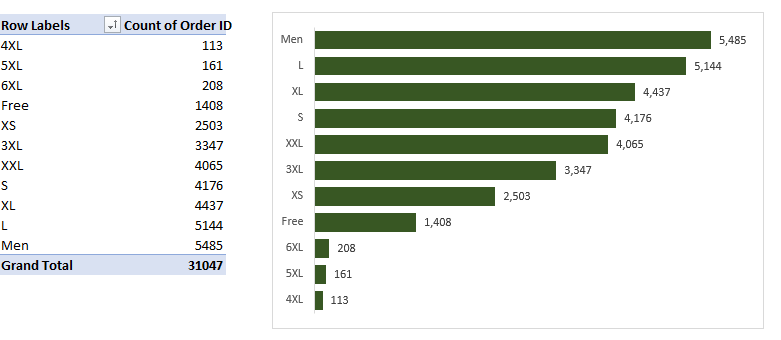

# Vrinda 2022 Sales Analysis


Image by Markus Winkler on [Unsplash](https://unsplash.com/photos/IrRbSND5EUc)

### Project Overview

In this project, I assume the role of a Data Analyst at Vrinda Clothing, a fashion brand located in India. The company wants to create an annual sales report for 2022 to understand its customers and grow more sales in 2023. My task is to share a dashboard showing the key metrics and trends of 2022 sales.

### About the Data Set

The dataset contains informatu on 31047 Vrinda customers, which includes 2022 sales details, customer profiles, and order history. The data was downloaded from a file shared by Rishabh Mishra on [GitHub](https://github.com/rishabhnmishra/Excel_Vrinda_Store_Analysis/blob/main/Vrinda%20Store%20Data%20Analysis.xlsx)

### Business Questions

I came up with the following business questions to guide my analysis and report:
1. What is the total sale and order for 2022?
2. What is the monthly sales trend?
3. What does the average customer look like?
4. Which product is most preferred?
5. Which channel has the highest order?

### Microsoft Excel Skills Applied

- Data Cleaning
- Excel Formulas
- Pivot Tables
- Charts
- Slicers
- Dashboard Building

### Data Cleaning and Manipulation

The original dataset contains **31047 rows** and **19 columns**. This cleaning process aims to identify and fix issues with quality and structure in the data and transform it into a more usable format for analysis

Here is how I cleaned the data:

- I started inspecting my data by checking for duplicated orders. I also checked for null values and issues with the data types. I applied the Remove Duplicates option from the Data tab in the "Order ID" column and no duplicates were found
- I removed the index column because Excel has a row number. I removed the currency column with just the currency symbol
- I replaced "M" with Male and "F" with Female in the Gender column using CTRL+H (find and replace shortcut)
- I changed all texts in the quantity column to figures and formatted the column as numerical. I also formatted the amount to INR currency
- I used the title case on the city column to ensure consistency with the PROPER function
- I created new columns as age brackets with the IF function
```Excel
=IF(E2<31, "Young Adult",  IF(E2<= 55, "Middle Age", "Old Adult"))
```
- I also extracted the month from the date column using the TEXT function
```Excel
=TEXT(F2, "mmm")
```

### Analysis and Visualization

To answer the business task, I selected the cleaned data and inserted a pivot table for my analysis. Firstly, the total sales, orders, and qualities sold were calculated.

Then, I analyzed the monthly sales and created a chart


To see what the average customer looks like, I analyzed the age…


…and the gender group per sale


I grouped each product by the total orders to see the most sold products


I applied the same process to see the best-selling sizes



Lastly, I analyzed the data to see the State with the highest sales


### Dashboard

I created a sales dashboard in Excel to provide insights and dynamic answers to the business task. You can interact with it [here](https://onedrive.live.com/view.aspx?resid=270DAFD4C444DCEA%21656&id=documents)


### Key Insights

- The total sales and orders for 2022 are 21.18 Million Rupees and 31,047 respectively.
- Women made 64% of the total sales and the middle-aged(31–55) made 51.66% of the sales.
- What are the women buying? They are buying more Sets and Kurtas, less of Blouse, Ethnic dresses and bottoms. Surprisingly they brought more men's sizes, followed by large, extra large, and small sizes.
- Maharashtra State has the highest sales with 2.9 Million and Karnataka with 2.6 Million Sales. Amazon has the highest order of 11,016, followed by Myntra with 7,254 orders.

### Recommendations

Based on the insights from my analysis, some recommendations I can make for Vrinda to grow more sales in 2023 are:

- For effective marketing strategies, women between the ages of 31 to 55 living in Maharashtra and Karnataka should be the main target audience
- Looking at the analysis, we can see that women brought men's sizes more. An exclusive deal for women gifting or buying products in men's size can be introduced
- There should be more production of Sets and Kurtas in the men's, Large, Extra Large, and small sizes. The company can reduce the production of Blouses, Ethnic dresses, and bottoms, the 4XL to 6XL sizes.
- A  product restocking process for channels should be put in place, especially for Amazon and Myntra
- For subsequent sales reports,  I recommend that existing customers be surveyed on why they buy from the company, and product reviews can also be analyzed. Focusing on why customers buy is a major way to increase sales and create interesting products. Reviews also guide in improving product quantity, customer service, and retention.

